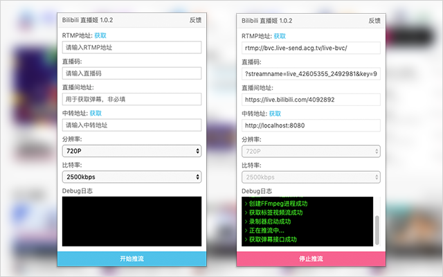

# :strawberry: Chrome 扩展 - Bilibili 直播姬

> 把浏览器页面直播到 Bilibili 直播间

## 说明

-   虽然叫`Chrome 扩展 - Bilibili 直播姬`，但实际上支持所有使用`rtmp`做推流的直播平台。

-   本扩展就是不借助`OBS`这类软件就可以直播浏览器页面，可以做成无人值守的`音乐轮播`或者`视频轮播`等等，后期集成`弹幕姬`功能后还可以做成`弹幕互动积分点播`音乐或者电影。

-   但浏览器本身是难以做到转码和推流的，所有还是需要一个额外的`NodeJs`程序来做中转服务，但这个`NodeJs`程序只有几十行代码且很容易扩展，可以本地运行也可以放到服务器运行。

-   本机亲测在分辨率`720P`和比特率`2500kbps`情况下，直播延迟在`10`秒内，不过本地的`录屏程序`和`FFmpeg`同时运行下会带来些浏览器卡顿。

## 安装

#### 客户端

-   [在线 chrome 网上应用商店](https://chrome.google.com/webstore/detail/jfgjlmafdjaofbkjpaoojooghnocjcag)
-   [代码目录 packages/client](./packages/client)

#### 服务端

-   [代码目录 packages/server](./packages/server)

也可以通过`npm`获取服务端代码：

```bash
npm i bilibili-live-hime-server
```

进入代码目录运行服务端，默认端口`8080`，默认中转地址就是`http://localhost:8080`：

```bash
npm start
```

## 使用

安装好`Chrome`扩展，假如服务端已经在运行情况下，就可以打开你想直播的浏览器页面，然后在扩展填好基本的直播信息(如下图)就可以开播了。

## 截图



## 捐助


## 交流


## License

MIT © [Harvey Zack](https://sleepy.im/)
